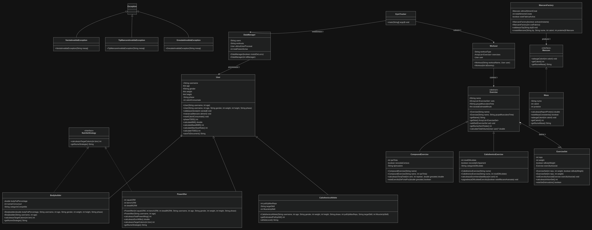

# Gym Tracker (Java OOP)

A desktop Java application for tracking workouts, nutrition, and athlete specific progression.

## Architecture & Class Design

The system models distinct training disciplines with unique progression and unique methods for each type of athlete and special tools to help them achieve their goals. 

<p align="center">
  
</p>

### Key Implementation Details

- **Athlete Specialization (Inheritance & Polymorphism):** 
  - Base `User` class extended by `Powerlifter`, `Bodybuilder`, and `CalisthenicsAthlete`.
  - Exercise types (`CompoundExercise` vs. `CalisthenicsExercise`) for different athletes and goals
- **Nutrition Module (Factory Pattern):**
  - Utilizes `MancareFactory` to instantiate food entities (`Masa`, `Mancare`), isolating calorie and macronutrient calculation.
- **Input Validation & Custom Exceptions:**
  - Domain constraints using custom checked exceptions (`GreutateInvalidaException`, `VarstaInvalidaException`, `TipMancareInvalidaException`).
- **File-Based Persistence (`DataManager`):**
  - Custom file parser reading and serializing profile state, exercise history, and workout logs to individual user profiles under `Database/`.

## Tech Stack
- **Language:** Java
- **Architecture:** Object-Oriented Design (UML Class Diagram designed in draw.io)
- **IDE / Build:** NetBeans

## Project Structure
```text
GymTracker/
├── src/gymtracker/       # Core domain models, factory, exceptions, DataManager
├── Database/             # User profiles and workout log storage
│   ├── users/
│   └── workouts/
├── docs/                 # UML architectural diagram
└── build.xml             # Ant build configuration
